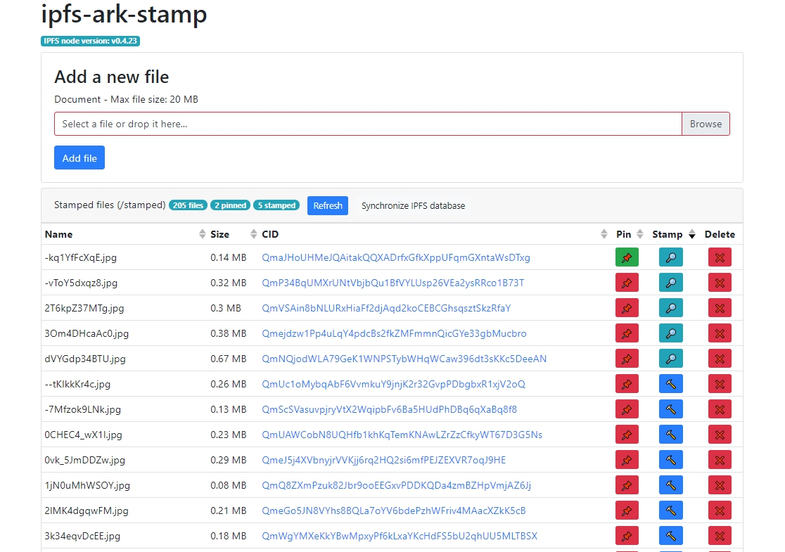

# ipfs-ark-stamp
> 📝 Add files to IPFS and stamp its IPFS CID hash permanently on the ARK Blockchain

Uses an [OrbitDB](https://github.com/orbitdb/orbit-db) log instance on the IPFS node to store the [ARK Blockchain](https://ark.io/) IPFS stamps transaction IDs associated with the IPFS files CIDs.

## Features
 - List/Add/Delete and Pin/Unpin files on the IPFS node
 - Stamp the IPFS file CID hash on the [ARK Blockchain](https://ark.io/)
 - Open the IPFS stamp transaction on the [ARK Blockchain Explorer](https://explorer.ark.io/)
 - Store the ARK Blockchain IPFS stamp transaction ID on the IPFS node using [OrbitDB](https://github.com/orbitdb/orbit-db)
 - Synchronize the local [OrbitDB](https://github.com/orbitdb/orbit-db) store with the already-broadcasted ARK Blockchain IPFS CIDs

## Install
```sh
yarn
```

## Build
```sh
yarn build
```

## Configure
You need to set environment variables to configure the project. Copy [`.env.example`](./.env.example) to `.env` and edit this file.

**This is required**.

| Configuration option | Description | Default value |
| -------------------- | ----------- | ------------- |
| `SERVER_PORT` | Server port | `5000` |
| `FILE_UPLOAD_MAX_SIZE` | Max accepted file size when uploading a file to the IPFS node | `20971520` (i.e. 20 MB) |
| `IPFS_NODE_MULTIADDR` | IPFS node multiaddr | `'/ip4/127.0.0.1/tcp/5001'` |
| `IPFS_NODE_STAMPED_DIR` | Directory to target on the IPFS node | `'/stamped'` |
| `ORBIT_DB_STORE` | OrbitDB log store | `'stamped_db'` |
| `ARK_API_URI` | ARK node API URI | `'https://dexplorer.ark.io/api/v2'` |
| `ARK_EXPLORER_URI` | ARK explorer URI | `'https://dexplorer.ark.io'` |
| `ARK_NETWORK` | ARK Blockchain network | `'devnet'` |
| `ARK_TRANSACTION_FEE` | ARK IPFS transaction stamp fees | `'10000000'` (i.e. `0.1 ARK`) |
| `ARK_WALLET_PASSPHRASE` | ARK wallet passphrase | `'wallet ark blockchain passphrase'` |

## Run
```sh
yarn start
```

## Screenshot


## License
[The MIT license](./LICENSE)
